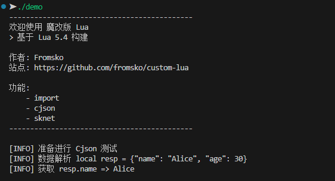

# Custom Lua language
>
> 自定义 Lua 第三方库

## 使用

```shell
# 构建
make

# 全局安装
make install

# 卸载全局
make uninstall

# 本地安装 build
make local

# 删除本地
make unlocal
```

### 新建项目

`初始化`

```shell
make new
```

`构建`

```shell
make
```

`执行`

```shell
./demo
```



## 新增功能

### 关键字: `import`
>
> 支持三种调用方式

```lua
import "os"
import("os", "cjson")
import {"os", "cjson", "sknet"}
```

### 新增内置库函数

#### `cjson`
>
> 集成第三方库 `cJSON`

```cpp
/*
** $Id: lcjson.c $
** Standard Operating System library
** See Copyright Notice in lua.h
*/

#define lcjsonlib_c
#define LUA_LIB

#include <stdlib.h>
#include "lprefix.h"
#include "lua.h"
#include "lauxlib.h"
#include "lualib.h"
#include "cJSON.h"

static int encode(lua_State *L)
{
  // 获取输入的 JSON 对象
  cJSON *json = cJSON_Parse(luaL_checkstring(L, 1));
  if (json == NULL)
  {
    luaL_error(L, "Invalid JSON string");
    return 0;
  }

  // 将 CJSON 对象编码为字符串
  char *json_string = cJSON_Print(json);
  if (json_string == NULL)
  {
    luaL_error(L, "Failed to encode JSON");
    return 0;
  }

  lua_pushstring(L, json_string); // 将 JSON 字符串压入 Lua 栈
  free(json_string);              // 释放 CJSON_Print 返回的字符串
  cJSON_Delete(json);             // 删除 CJSON 对象
  return 1;                       // 返回一个结果
}

static int decode(lua_State *L)
{
  // 获取输入的 JSON 字符串
  const char *json_string = luaL_checkstring(L, 1);
  cJSON *json = cJSON_Parse(json_string);
  if (json == NULL)
  {
    luaL_error(L, "Invalid JSON string");
    return 0;
  }

  // 将 CJSON 对象转换为 Lua 表
  lua_newtable(L);
  cJSON *item = json->child;
  while (item)
  {
    const char *key = item->string;
    if (key)
    {
      lua_pushstring(L, key);
      if (item->type == cJSON_String)
      {
        lua_pushstring(L, item->valuestring);
      }
      else if (item->type == cJSON_Number)
      {
        lua_pushnumber(L, item->valuedouble);
      }
      else if (item->type == cJSON_True)
      {
        lua_pushboolean(L, 1);
      }
      else if (item->type == cJSON_False)
      {
        lua_pushboolean(L, 0);
      }
      else if (item->type == cJSON_NULL)
      {
        lua_pushnil(L);
      }
      else
      {
        lua_pushnil(L); // 处理其他类型
      }
      lua_settable(L, -3); // 将键值对放入表中
    }
    item = item->next;
  }

  cJSON_Delete(json); // 删除 CJSON 对象
  return 1;           // 返回 Lua 表
}

static const luaL_Reg cjsonlib[] = {
    {"encode", encode},
    {"decode", decode},
    {NULL, NULL},
};

/* }====================================================== */

LUAMOD_API int luaopen_cjson(lua_State *L)
{
  luaL_newlib(L, cjsonlib);
  return 1;
}
```

#### `sknet`
>
> 集成第三方库 `iclient`

```cpp
/*
** $Id: lsknetlib.c $
** Standard Operating System library
** See Copyright Notice in lua.h
*/

#define lsknetlib_c
#define LUA_LIB

#include <stdlib.h>
#include "lprefix.h"
#include "lua.h"
#include "lauxlib.h"
#include "lualib.h"
#include "cJSON.h"

static int get(lua_State *L)
{
    return 1; // 返回一个结果
}

static int post(lua_State *L)
{
    return 1; // 返回 Lua 表
}

static int delete(lua_State *L)
{
    return 1; // 返回一个结果
}

static int put(lua_State *L)
{
    return 1; // 返回 Lua 表
}

static const luaL_Reg sknetlib[] = {
    {"get", get},
    {"post", post},
    {"delete", delete},
    {"put", put},
    {NULL, NULL},
};

/* }====================================================== */

LUAMOD_API int luaopen_cjson(lua_State *L)
{
    luaL_newlib(L, sknetlib);
    return 1;
}
```
